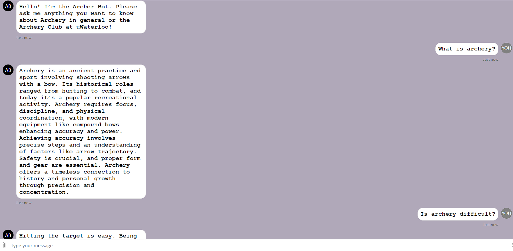
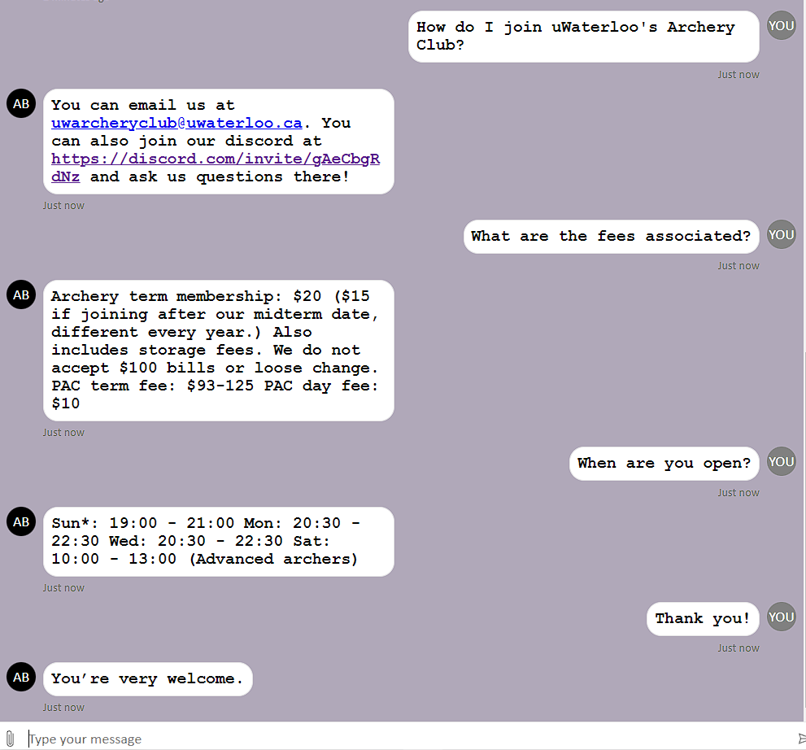

# Ask us questions about Archery!
## [ArcherBot.com](https://rukhan4.github.io/azure-chat-bot/)

## Key Features

- **Custom Knowledge Base**: The bot is empowered by a meticulously curated knowledge base on everything there is to know about archery. It also contains information on uWaterloo's Archery Club.

- **HTML and CSS Frontend**: The bot's frontend interface provides a visually appealing and user-friendly interaction platform. This frontend facilitates easy navigation, interaction, and information retrieval, enhancing the overall user experience.

- **JavaScript Bot Activator**: JavaScript serves as the dynamic bot activator, enabling real-time interactions and responses. The bot leverages JavaScript's capabilities to process user input, trigger appropriate responses, and seamlessly integrate with the HTML frontend.

## Benefits

- **Intuitive User Interaction**: The combination of HTML, CSS and JavaScript create a highly intuitive and responsive interface, ensuring users can effortlessly engage with the bot and access the information they need.

- **Accurate Responses**: The custom knowledge base empowers the bot to provide accurate and contextually appropriate responses, enhancing user satisfaction and confidence in the bot's capabilities.

- **Real-time Engagement**: JavaScript's dynamic nature enables real-time engagement, allowing users to receive instant responses and fostering a seamless and dynamic conversation.

## Pull Requests

To contribute code directly to the project, you can submit a pull request:

1. Fork the repository to your GitHub account.
2. Clone your forked repository to your local machine.
3. Create a new branch for your changes: `git checkout -b feature-name`.
4. Make your modifications and commit your changes: `git commit -m "Add new feature"`.
5. Push your changes to your forked repository: `git push origin feature-name`.
6. Open a pull request against the `main` branch of the original repository.

Please ensure your code follows our coding standards and practices. We'll review your pull request, provide feedback, and work together to merge your changes into the project.

### Sample Questions:

- What is Archery?
- Is Archery difficult?
- How do I contact uWaterloo's Archery Club?
- Is Archery dangerous?
- Tell me a joke about Archery
- What's so great about Archery?

### Bot usage 

